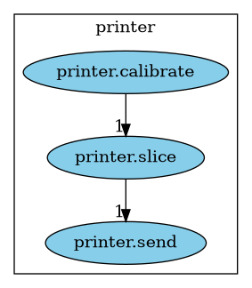

- [alternative use case, explicitly defining the flow](#db06b88c-a231-4f46-b8f7-54e98db07e17)
- [more information about the flow](#org46b9502)
- [when the flow is wrong](#96a6905e-06bd-48d5-a117-7e81ebde9399)

When you get used to create groups of commands, you generally end up having a sequence that comes out quite naturally.

It is handy to have each command do one thing and do it well, while at the same time have a shortcut to chain them.

For the sake of the example, let's suppose you are writing a bunch of commands to perform 3d printing. Hereafter, the printing aspect will be mocked. Its only interest is to show one of my real life usages of clk.

You would first create the group of commands named `printer` like so.

```bash
clk command create python --group printer --description "This is a group of commands to deal with 3D printing."
```

Classically, with the end result in mind, you may start by writing the command that sends the final gcode to the printer.

```python
@printer.command()
@option("--gcode", help="The gcode file", default="model.gcode")
@flag("--warn-when-done", help="Trigger a notification when done")
@argument("printer", help="The ip of the printer to send the gcode to")
def send(gcode, warn_when_done, printer):
    """Send some gcode to your printer"""
    print(f"Printing {gcode} using {printer}")
    if warn_when_done:
        print("Driiiiiiing!")
```

In general, to get the gcode file that contains printer instruction, you first slice a 3D model, most likely in the format STL.

Let's create this command.

```python
@printer.command()
@option("--model", default=["model.stl"], help="The model to slice", multiple=True)
@option("--output", default="model.gcode", help="The file getting the final gcode")
def slice(model, output):
    """Slice a model"""
    print("Slicing " + ", ".join(model) + f" to {output}")
```

Now, we have a command that slices the 3D model to a gcode and one command to send the gcode instructions to the printer.

That is nice. And you can play with those two commands, until you realize that you also need to calibrate the printer before running the print. Let's create this calibrate command.

```python
@printer.command()
def calibrate():
    """Run everything that is needed to have the printer ready to print"""
    print("Running some stuff for the printer to be ready to go")
```

Great, we created three commands to play with our printer.

In most cases, we want to chain those commands in a so-called flow.

Let's define such a flow.

```python
from clk.overloads import get_command

@printer.flow_command(flowdepends=["printer.calibrate"])
@get_command("printer.slice").flow_option("model")
@get_command("printer.send").flow_option("warn_when_done")
@get_command("printer.send").flow_argument("printer")
def flow(**kwargs):
    """Run the whole flow"""
    print("The flow is done")
```

Note that calibrate, slice and send don't have any precedence relationship between each other. By providing `flow_command`, `flow_option` and `flow_argument` in that order, we explicitly say to the command named flow that it should run them from top to bottom: calibrate, slice and then send.

The flow\_option and flow\_argument lines tell that this new command "captures" those parameters from the respective commands.

This new command can be called with `--model`, `--warn-when-done` and `--printer` and will eventually run `printer calibrate`, `printer slice` and then `printer send` with the appropriate parameters.

Note that we only defined explicitly the flow dependency to `printer calibrate`. The dependency to `printer slice` and `printer send` is implicitly known by the fact we captured some of their parameters.

Let's try to run the flow to get the feeling of how it is used.

```bash
clk printer flow myprinter --model somemodel --model someothermodel --warn-when-done
```

    Running some stuff for the printer to be ready to go
    Slicing somemodel, someothermodel to model.gcode
    Printing model.gcode using myprinter
    Driiiiiiing!
    The flow is done


<a id="db06b88c-a231-4f46-b8f7-54e98db07e17"></a>

# alternative use case, explicitly defining the flow

You might want to stick with those 3 commands and don't want to add the extra command `flow` to glue them together. This is doable by explicitly defining the flow in the definition of `@printer.command` on top of every commands.

Yet get something like this.

```python
@printer.command()
def calibrate():
    """Run everything that is needed to have the printer ready to print"""
    print("Running some stuff for the printer to be ready to go")

@printer.command(flowdepends=["printer.calibrate"])
@option("--model", default=["model.stl"], help="The model to slice", multiple=True)
@option("--output", default="model.gcode", help="The file getting the final gcode")
def slice(model, output):
    """Slice a model"""
    print("Slicing " + ", ".join(model) + f" to {output}")

@printer.command(flowdepends=["printer.slice"])
@option("--gcode", help="The gcode file", default="model.gcode")
@flag("--warn-when-done", help="Trigger a notification when done")
@argument("printer", help="The ip of the printer to send the gcode to")
def send(gcode, warn_when_done, printer):
    """Send some gcode to your printer"""
    print(f"Printing {gcode} using {printer}")
    if warn_when_done:
        print("Driiiiiiing!")
```

Now, you only have three commands and running the flow needs to be done explicitly.

```bash
echo "# Running the send command, without the flow"
clk printer send myprinter
echo "# Running the send command, asking for its flow"
clk printer send myprinter --flow
```

    # Running the send command, without the flow
    Printing model.gcode using myprinter
    # Running the send command, asking for its flow
    Running some stuff for the printer to be ready to go
    Slicing model.stl to model.gcode
    Printing model.gcode using myprinter

Doing so, there is no way to provide the parameters of the commands of the flow. If you want to provide a value for `--model` of `printer slice`, you will have to use parameters.

```bash
clk parameter set printer.slice --model someothermodel
clk printer send myprinter --flow
```

    New global parameters for printer.slice: --model someothermodel
    Running some stuff for the printer to be ready to go
    Slicing someothermodel to model.gcode
    Printing model.gcode using myprinter

Here, your mileage may vary. Choose the implementation that suits you better.


<a id="org46b9502"></a>

# more information about the flow

If you feel lost about what the current flow has become, you have a few ways to dig into it.

First, you can list the commands that would be run in a flow using the flowdep command.

```bash
clk flowdep show printer.send --all
```

    printer.send printer.calibrate printer.slice

Then, you can show the graph

```bash
clk flowdep graph printer.send --format png --output flow.png
```

```bash
clk flowdep graph printer.send --format dot --output flow.dot
dot -Tpng flow.dot > flow.png
```



To get more insight of when a part of the flow is running, you can try to enable the verbose mode.

```bash
clk --flow-verbose printer send myprinter --flow
```

    1/2 Running step 'printer calibrate'
    Running some stuff for the printer to be ready to go
    2/2 Running step 'printer slice'
    Slicing someothermodel to model.gcode
    Printing model.gcode using myprinter

And, to make sure not to miss anything, you can run the step by step mode as well. Note that this will also enable automatically the flow-verbose option.

```bash
yes | clk --flow-step printer send myprinter --flow
```

    1/2 About to run step 'printer calibrate'
    Press Enter to start this step: Here we go!
    Running some stuff for the printer to be ready to go
    2/2 About to run step 'printer slice'
    Press Enter to start this step: Here we go!
    Slicing someothermodel to model.gcode
    Printing model.gcode using myprinter

Note that there also exists a `--flow-progress` option that may be useful if your commands are silent by default. In that case, the output shall be a bit messy.

```bash
clk --flow-progress printer send myprinter --flow
```

    Executing flow steps:   0%|           | 0/2 [00:00<?, ?it/s]printer calibrate:   0%|              | 0/2 [00:00<?, ?it/s]Running some stuff for the printer to be ready to go
    printer slice:   0%|                  | 0/2 [00:00<?, ?it/s]Slicing someothermodel to model.gcode
    printer slice: 100%|████████| 2/2 [00:00<00:00, XX.XXit/s]
    Printing model.gcode using myprinter

Of course, using it with `--flow-step` would make things even more messy, so use the right option for the flows you will run, depending on your use cases.


<a id="96a6905e-06bd-48d5-a117-7e81ebde9399"></a>

# when the flow is wrong

Let's assume you miss-typed the flow dependencies. Something like.

```python
@printer.command()
def calibrate():
    """Run everything that is needed to have the printer ready to print"""
    print("Running some stuff for the printer to be ready to go")

@printer.command(flowdepends=["printer.calib"])
@option("--model", default=["model.stl"], help="The model to slice", multiple=True)
@option("--output", default="model.gcode", help="The file getting the final gcode")
def slice(model, output):
    """Slice a model"""
    print("Slicing " + ", ".join(model) + f" to {output}")

@printer.command(flowdepends=["printer.slice"])
@option("--gcode", help="The gcode file", default="model.gcode")
@flag("--warn-when-done", help="Trigger a notification when done")
@argument("printer", help="The ip of the printer to send the gcode to")
def send(gcode, warn_when_done, printer):
    """Send some gcode to your printer"""
    print(f"Printing {gcode} using {printer}")
    if warn_when_done:
        print("Driiiiiiing!")
```

```bash
  clk command create python --group printer --description "This is a group of commands to deal with 3D printing." --body '
@printer.command()
def calibrate():
    """Run everything that is needed to have the printer ready to print"""
    print("Running some stuff for the printer to be ready to go")

@printer.command(flowdepends=["printer.calib"])
@option("--model", default=["model.stl"], help="The model to slice", multiple=True)
@option("--output", default="model.gcode", help="The file getting the final gcode")
def slice(model, output):
    """Slice a model"""
    print("Slicing " + ", ".join(model) + f" to {output}")

@printer.command(flowdepends=["printer.slice"])
@option("--gcode", help="The gcode file", default="model.gcode")
@flag("--warn-when-done", help="Trigger a notification when done")
@argument("printer", help="The ip of the printer to send the gcode to")
def send(gcode, warn_when_done, printer):
    """Send some gcode to your printer"""
    print(f"Printing {gcode} using {printer}")
    if warn_when_done:
        print("Driiiiiiing!")
'
```

When you run it, you will get the error

```bash
clk printer send --flow myprinter
```

    error: The flow of printer.slice could not be resolved. Command printer.calib not found
    error: The flow of printer.send could not be resolved. Command printer.calib not found
    Usage: clk printer send [OPTIONS] PRINTER
    error: No such option: --flow
    Hint: If you don't know where this option comes from, try checking the parameters (with clk --no-parameter parameters show).

Beware that this means that you have to check that this command it actually defined.
